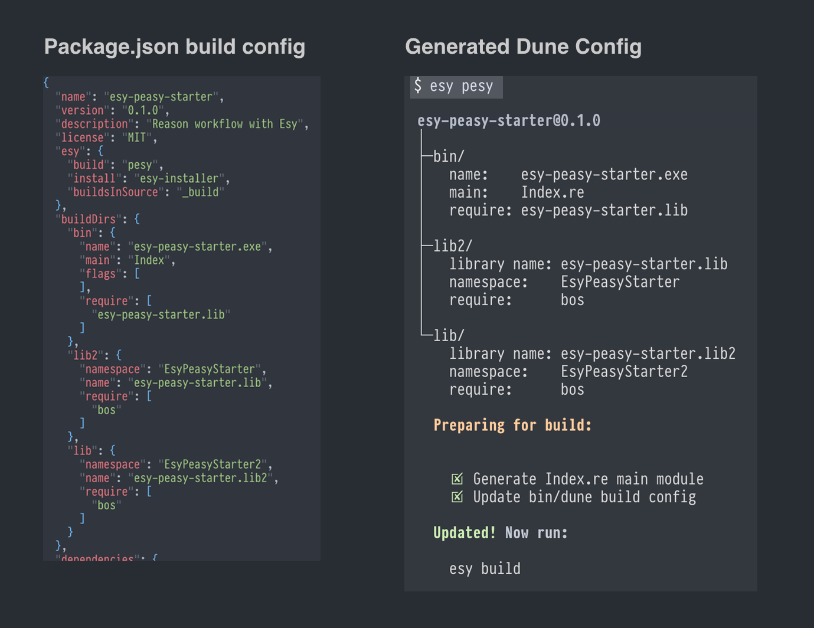

# pesy: Native Reason Project from Json.

- Use `package.json` to declare libraries and executables.
- Generates `dune` config per directory.





### Use As Your Package Build Command:

**1. Add a dependency on `pesy`, and configure `buildDirs`:**

    "name": "my-package",
    "dependencies": {
      "pesy": "*"
    },
    "bin": {
      "name": "my-package.exe",
      "require": [
        "my-package.lib"
      ]
    },
    "buildDirs": {
      "exampleLib": {
        "namespace": "Examples",
        "name": "my-package.example-lib",
        "require": [ "bos.top" ]
      }
    }

**2.Install and Build:**

```sh
esy install
esy pesy  # Generate the project build config from json
esy build
```
### Use As Standalone To Create Projects

**Coming Soon** Not Yet Implemented


## Example Project:

The following example project already has an example config. You can base your
project off of this one.

```sh
npm install -g esy@next
git clone git@github.com:jordwalke/esy-peasy-starter.git

esy install
esy pesy    # Use pesy to configure build from package.json
esy build

```

- Change the `name` of the package, and names of libraries in `buildDirs`
  accordingly.
- Then rerun:

```
esy pesy
esy build
```

## Testing Binaries:

Use the standard `esy x any-command-here` command to run `any-command-here` as
if you had installed the package. For example `esy x YourPackage.exe --args`
builds and runs your built `YourPackage.exe` executable with arguments.


## Consuming New Library Dependencies:

- Add dependencies to `dependencies` in `package.json`.
- Add the name of that new dependencies *library*  to `package.json`'s
  `buildDirs` section that you want to use the library within. For example, if
  your project builds a library in the `exampleLib/` directory, and you want it
  to depend on a library named `bos.top` from an opam package named `bos`,
  change the `package.json` to look like this:
   
    "name": "my-package",
    "dependencies": {
      "@opam/bos": "*"
    },
    "buildDirs": {
      "exampleLib": {
        "namespace": "Examples",
        "name": "my-package.example-lib",
        "require": [ "bos.top" ]
      }
    }

- Then run:
```
esy install  # Fetch dependency sources
esy pesy     # Configure the build based on package.json
esy build    # Do the build
```
 
> Note: After adding/building a new dependency you can use `esy ls-libs` to see
> which named libraries become available to you by adding the package
> dependency.

> Note: You can also use `esy ls-modules` to see which named _modules_ become
> available to you from those libraries.


## Tradeoffs:
`esy-peasy` is good for rapidly making new small executables/libraries. Once they
grow, you'll want to "eject out" of `esy-peasy` and begin customizing using a more
advanced build system.
